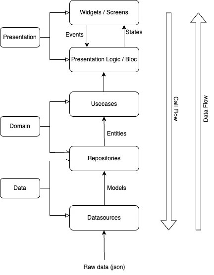

# books_app

BOOKS APP

- Clean Architecture 
- BLOC

1. Core  
   `core` klasörü, uygulamanın temel yapı taşlarını barındırır. Bu bölümde hata yönetimi, ağ işlemleri ve genel servisler gibi tüm uygulamada ortak kullanılabilecek bileşenler yer alır.

2. Data  
   `data` katmanı, veriyi elde etmek ve yönetmekle sorumludur. Burada API veya veritabanı gibi kaynaklardan veri çeken sınıflar bulunur. Bu veriler daha sonra uygulamanın diğer katmanlarına iletilir.

   - **datasources**: Veri kaynaklarına erişim sağlayan sınıflar.
   - **models**: Elde edilen veriyi temsil eden veri modelleri.
   - **repositories**: Veriyi yönetmek için kullanılan ara katman.

3. Domain  
   `domain` katmanı, uygulamanın iş kurallarını ve mantığını içerir. Bu katman, uygulamanın en önemli kısmıdır çünkü iş mantığı burada tanımlanır.

   - **entities**: Uygulamanın temel nesneleri.
   - **repositories**: Verilerin nasıl elde edildiğine dair tanımlamalar.
   - **usecases**: Uygulamanın iş mantığını temsil eden kullanım senaryoları.

4. Foundation  
   `foundation` katmanı, uygulamanın genel yapı taşlarını içerir. Bu bölümde sabitler, uzantılar ve yardımcı sınıflar gibi uygulamanın farklı bölümlerinde tekrar tekrar kullanılabilecek yapılandırmalar yer alır.

5. Presentation  
   `presentation` katmanı, kullanıcı arayüzünü ve bu arayüzle ilgili mantığı içerir. Bloc'lar, sayfalar ve tema yapılandırmaları bu katmanda yer alır.

   - **bloc**: Uygulamanın durum yönetimini sağlayan Bloc sınıfları.
   - **pages**: Kullanıcıya gösterilen ekranlar.
   - **theme**: Uygulamanın görünümü ve tema ayarları.
   - **widgets**: Tekrar kullanılabilir UI bileşenleri.

6. DI (Dependency Injection)  
   `di` klasörü, bağımlılıkları yönetmek için kullanılır. Uygulamada kullanılan servisler, sınıflar ve diğer bağımlılıklar burada tanımlanır ve uygulamanın farklı yerlerinde bu bağımlılıklar kolayca enjekte edilebilir.
